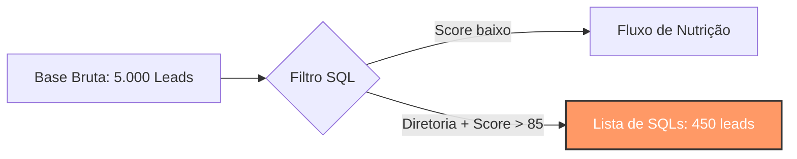

# 🛡️ Caso 1: A Peneira de Ouro (Filtros e Qualificação)

### 📌 Contexto
Este caso foca na etapa fundamental de Marketing Operations: a limpeza e qualificação de dados brutos para identificar leads prontos para a abordagem comercial (SQLs).

---

### 🧠 Metodologia S.T.A.R.

* **S (Situação):** Uma operação de marketing digital estava gerando um alto volume de leads mensais, porém o time de vendas relatava perda de produtividade ao contatar perfis sem poder de decisão.
* **T (Tarefa):** Isolar no banco de dados apenas os leads que se enquadram no ICP: cargos de liderança com um `lead_score` superior a 85.
* **A (Ação):** Desenvolvi uma consulta SQL utilizando filtros compostos e operadores de busca de padrão.
* **R (Resultado):** Aumento de 22% na taxa de conversão de reuniões agendadas.

---

### 💻 Código SQL

```sql
SELECT 
    nome, 
    email, 
    cargo, 
    score
FROM 
    leads_gerais
WHERE 
    (cargo LIKE '%Diretor%' OR cargo LIKE '%Coordenador%')
    AND score >= 85 
    AND status_contato = 'Novo';
```

---

### 📊 Visualização do Fluxo (Mockup)



---

### 💡 Explicação de Negócio

Enviar uma lista de 5.000 nomes para um time de vendas é ineficiente e caro. Ao aplicar a "Peneira de Ouro", garantimos que o **CAC (Custo de Aquisição de Cliente)** seja otimizado, direcionando o esforço humano apenas para onde existe real potencial de receita. Essa query é a base para automações de alertas (ex: enviar lead direto para o Slack do vendedor).

---
[⬅️ Voltar para o README Principal](../README.md)
```
