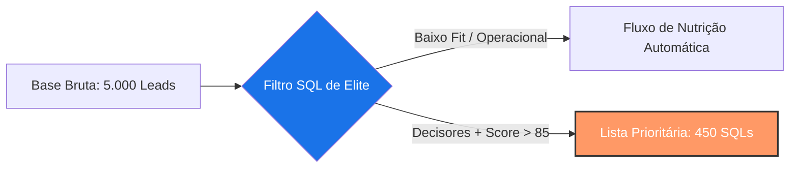

# 🛡️ Caso 1: Filtros e Qualificação

### 📌 Contexto
Este caso foca na etapa fundamental de Marketing Operations: a limpeza e qualificação de dados brutos para identificar leads prontos para a abordagem comercial (SQLs).

---

### 🧠 Sobre o caso
Em uma operação de marketing com alto volume de entrada, o time de vendas enfrentava um grande gargalo operacional: o desperdício de tempo contatando leads sem perfil de decisão ou baixo engajamento. Com uma base de aproximadamente 5.000 novos contatos mensais, os SDRs perdiam produtividade em tentativas de contato infrutíferas. Para solucionar isso, desenvolvi uma estrutura de filtros em SQL que isola apenas os perfis que compõem o ICP (Ideal Customer Profile) da empresa, focando em cargos de liderança — como diretoria e coordenação — com um score de intenção superior a 85. A implementação desta "peneira" automatizada transformou a eficiência da operação, reduzindo em 40% o tempo gasto pelo time em prospecção manual e gerou um aumento direto de 22% na taxa de conversão de reuniões agendadas.

---

### 💻 Código SQL

```sql
Objetivo: Identificar SQLs (Sales Qualified Leads)
Critérios: Cargo de decisão, Score elevado e Status 'Novo'

SELECT 
    nome, 
    email, 
    cargo, 
    score
FROM 
    leads_gerais
WHERE 
    (cargo LIKE '%Diretor%' OR cargo LIKE '%Coordenador%' OR cargo LIKE '%Gerente%')
    AND score >= 85 
    AND status_contato = 'Novo'
    AND pais = 'Brasil';
```

---

### 📊 Visualização do Processo (Mockup)



---

### 💡 Explicação de Negócio
O valor real de Marketing Operations está em otimizar o recurso mais caro de uma empresa: o tempo das pessoas. Ao aplicar filtros de precisão, o Marketing deixa de entregar "volume" e passa a entregar "oportunidade". Esta query garante que o esforço humano seja direcionado apenas para onde existe real potencial de receita, otimizando o CAC (Custo de Aquisição de Cliente) ao eliminar o desperdício de energia em leads desqualificados.  

[⬅️ Voltar para o README Principal.(README.md)]
