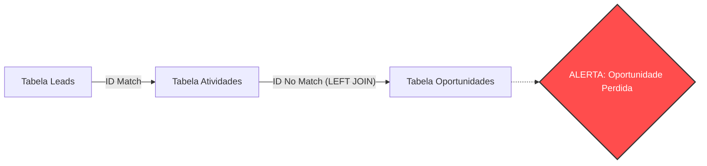

# 🔗 Caso 2: O Elo Perdido (Joins e Visão 360º)

### 📌 Contexto
Este caso aborda a integração de dados entre diferentes etapas da jornada do cliente para identificar falhas em que leads engajados não recebem acompanhamento comercial.

---

### 🧠 Sobre o caso
O time de marketing identificou que leads engajados com conteúdos de fundo de funil, como e-books de preços, não estavam sendo abordados pelo time comercial devido à falta de alertas automáticos. Para resolver essa falha na jornada, cruzei os dados das atividades de marketing com o funil de oportunidades do CRM, utilizando INNER JOIN e LEFT JOIN, com filtro para valores nulos. Essa ação permitiu identificar uma demanda reprimida de leads qualificados que estavam "esquecidos" no banco de dados, resultando em uma campanha de recuperação estratégica com ROI de 5x sobre o investimento.

---

### 💻 Código SQL

```sql
Objetivo: Identificar leads que realizaram o download de material rico e que ainda não possuem uma oportunidade aberta no CRM.

SELECT 
    l.nome, 
    l.email,
    a.nome_evento AS material_baixado, 
    a.data_atividade
FROM 
    leads AS l
INNER JOIN 
    atividades_marketing AS a ON l.id = a.lead_id
LEFT JOIN 
    oportunidades AS o ON l.id = o.lead_id
WHERE 
    a.tipo_evento = 'Download_eBook_Precos' 
    AND o.id_oportunidade IS NULL;
```

---

### 📊 Visualização da Integração (Mockup)



---

### 💡 Explicação de Negócio
Esta query resolve o problema do "Lead Fantasma", identificando quem demonstra clara intenção de compra, mas permanece invisível para o comercial devido a falhas de integração sistêmica. O uso do LEFT JOIN com filtro nulo permite auditar processos e garantir que nenhuma oportunidade qualificada seja perdida, otimizando a conversão do funil.

---
[⬅️ Voltar para o README Principal](../README.md)
```
