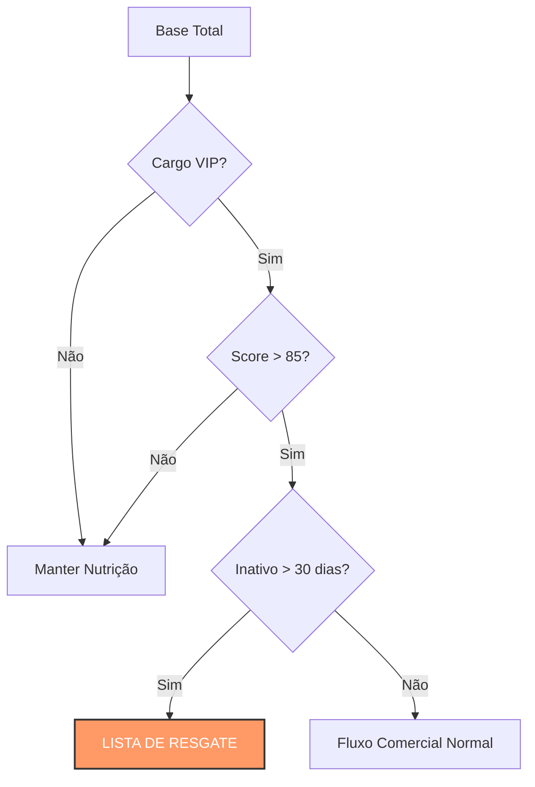

# ⚔️ Caso 2: Lógica de Precedência

### 📌 Contexto
Este caso demonstra o uso estratégico de lógica booleana avançada para recuperar oportunidades de alto valor que esfriaram no funil comercial por falta de interação.

---

### 🧠 Sobre o caso
Identificamos que uma parcela crítica de leads com cargos de decisão (C-Level e Diretores) estava sem interações do time comercial há mais de 30 dias, o que representa um risco de perda de receita qualificada. Para solucionar esse problema, desenvolvi uma query de auditoria que utiliza parênteses para garantir a precedência correta dos filtros, isolando lideranças com alto score e inatividade prolongada. A ação resultou na abertura imediata de 15 novas oportunidades de negócio que estavam anteriormente estagnadas.

---

### 💻 Código SQL
Objetivo: Recuperação de Leads VIP Inativos

```sql
SELECT 
    nome, 
    cargo, 
    score,
    dias_desde_ultimo_contato
FROM 
    leads_potenciais
WHERE 
    (cargo = 'coordenador' OR cargo = 'diretor' OR cargo = 'ceo') 
    AND score > 85 
    AND dias_desde_ultimo_contato > 30;
```

---

### 📊 Visualização de Lógica (Mockup)



---

### 💡 Explicação de Negócio
No CRM, o tempo é o maior inimigo da conversão; quanto mais tempo um lead qualificado leva sem contato, menores são as chances de fechamento. Esta query atua como um sistema de segurança operacional, impedindo que o investimento na aquisição de perfis de alto escalão seja desperdiçado devido a falhas de processo. A precisão na lógica de parênteses é fundamental para evitar erros de segmentação na abordagem.

[⬅️ Voltar para o README Principal](https://github.com/daniloespeleta/sql-crm-portfolio/blob/main/README.md)
