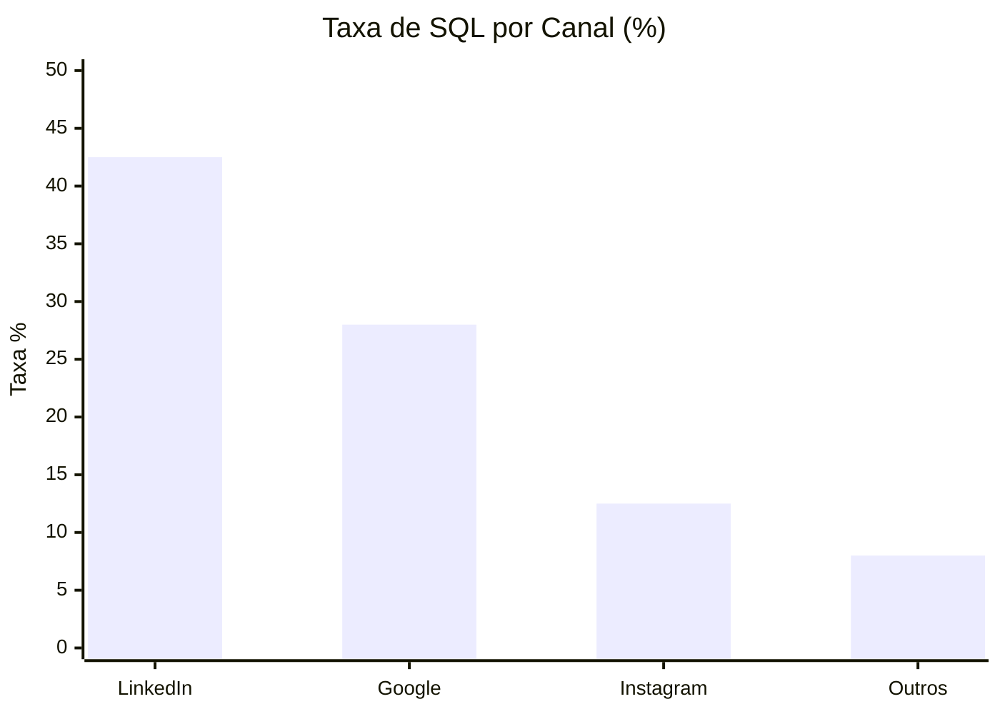

# 📈 Caso 3: Agregação e Métricas

### 📌 Contexto
Este caso foca na análise de desempenho dos canais de aquisição para a otimização estratégica do orçamento de mídia paga.

---

### 🧠 Sobre o caso
A diretoria de marketing enfrentava incertezas sobre qual canal de aquisição, Google, Instagram ou LinkedIn, entregava leads com o melhor fit de negócio, já que a análise anterior se baseava apenas no volume bruto de cadastros. Para solucionar isso, desenvolvi uma query de agregação que calcula a taxa de conversão de perfil (SQLs em relação ao total de leads) por canal de origem. Ao identificar que o LinkedIn possuía uma taxa de qualificação significativamente superior aos demais canais, a empresa realocou o orçamento de mídia de forma estratégica, resultando em uma redução de 18% no CAC (Custo de Aquisição de Cliente) global.

---

### 💻 Código SQL

```sql
/* Objetivo: Ranking de Canais por Taxa de Qualificação (SQL Rate) */

SELECT 
    origem_lead, 
    COUNT(id) AS total_leads,
    COUNT(CASE WHEN score >= 85 THEN 1 END) AS total_sqls,
    ROUND(COUNT(CASE WHEN score >= 85 THEN 1 END) * 100.0 / COUNT(id), 2) AS taxa_conversao_sql
FROM 
    leads_gerais
GROUP BY 
    origem_lead
ORDER BY 
    taxa_conversao_sql DESC;
```

---

### 📊 Visualização de Performance (Mockup)



---

### 💡 Explicação de Negócio
Em Growth Marketing, volume sem qualidade representa desperdício de capital. Esta análise funciona como uma bússola estratégica ao indicar onde o "dinheiro inteligente" deve ser alocado. Ao focar na taxa de conversão de perfil em vez de apenas no custo por clique (CPC), transformamos o investimento em marketing em um motor de crescimento previsível e focado em receita real.

---
[⬅️ Voltar para o README Principal](../README.md)
```
