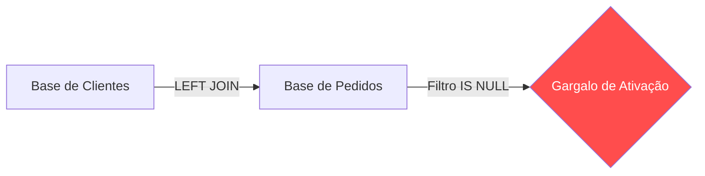

# 🔗 Caso 3: Visão 360º de Customer Success

### 📌 Contexto
Estratégia de Customer Success focada na ativação de novos clientes para reduzir o churn precoce por meio do cruzamento de dados.

---

### 🧠 Sobre o caso
Suspeitava-se que muitos novos clientes realizavam a compra, mas apresentavam alto churn inicial por não realizarem a primeira ação de valor (ativação) no produto. Para mapear esse cenário, utilizei o `LEFT JOIN` combinado com o filtro `IS NULL` para identificar lacunas na tabela de vendas, isolando os clientes cadastrados sem registros de pedidos. A identificação correta dessa base permitiu intervenções proativas do time de Customer Success, reduzindo o tempo de ativação em 15 dias.

---

### 💻 Código SQL
Objetivo: Identificar Clientes Ativos sem Pedidos (gaps de ativação)

```sql

SELECT 
    c.nome, 
    c.email,
    c.data_cadastro 
FROM 
    clientes AS c
LEFT JOIN 
    pedidos AS p ON c.id = p.cliente_id
WHERE 
    p.id_pedido IS NULL;
```

---

### 📊 Visualização de Lacuna (Mockup)



---

### 💡 Explicação de Negócio
O sucesso do cliente começa no Onboarding[cite: 4]. Se o cliente pagar pelo serviço e não o utilizar, ele cancelará. O SQL atua como um radar para identificar o gap entre o cadastro e o uso, permitindo que a empresa intervenha de forma proativa antes que o cliente desista da solução, protegendo o LTV (Lifetime Value).

[⬅️ Voltar para o README Principal](https://github.com/daniloespeleta/sql-crm-portfolio/blob/main/README.md)
