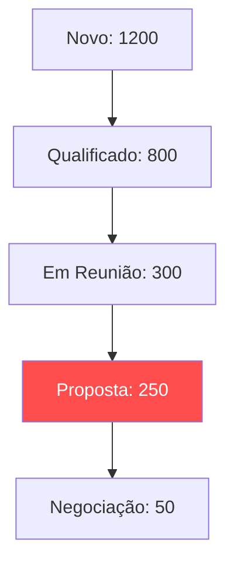

# 📊 Caso 4: Agregação de funil

### 📌 Contexto
Análise volumétrica do pipeline de vendas para a gestão de capacidade e a detecção de gargalos operacionais.

---

### 🧠 Sobre o caso
O time comercial encontrava-se sobrecarregado, mas as metas de fechamento não eram atingidas devido à falta de clareza sobre onde os leads estavam ficando retidos no processo comercial. Desenvolvi uma query de agregação volumétrica por estágio do pipeline utilizando as funções `COUNT` e `GROUP BY`. A análise identificou um acúmulo excessivo e um gargalo crítico na etapa 'Proposta Enviada', o que levou à decisão de automatizar a geração de documentos para acelerar a conclusão dos contratos.

---

### 💻 Código SQL
Objetivo: Monitorar volume por estágio do funil

```sql
SELECT 
    etapa_funil, 
    COUNT(id) AS total_leads
FROM 
    leads 
GROUP BY 
    etapa_funil 
ORDER BY 
    total_leads DESC;
```

---

###📊 Visualização de Funil (Mockup)



---

### 💡 Explicação de Negócio
O SQL transforma percepções subjetivas da equipe comercial em dados concretos para a gestão. Visualizar onde o funil está inchado permite que o gestor aplique os recursos corretos (sejam treinamentos ou automações de software) no local exato para destravar o fluxo de receita.

[⬅️ Voltar para o README Principal](https://github.com/daniloespeleta/sql-crm-portfolio/blob/main/README.md)
