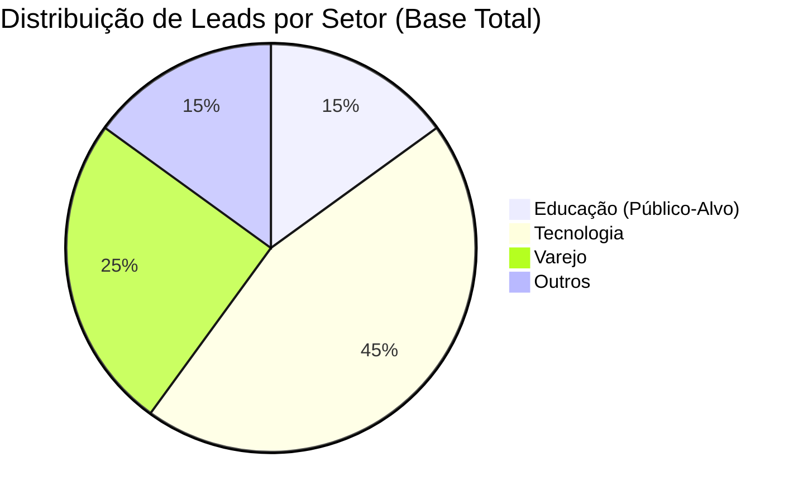

# 🎯 Caso 4: Segmentação por Setor

### 📌 Contexto
Este caso demonstra a segmentação cirúrgica para campanhas personalizadas de nicho, visando aumentar o engajamento e a conversão.

---

### 🧠 Sobre o caso
Diante do lançamento de uma funcionalidade exclusiva para Instituições de Ensino, o time de marketing precisava de uma segmentação precisa para garantir que a comunicação fosse altamente relevante e não gerasse ruído para o restante da base. Utilizei o SQL para filtrar leads específicos do setor de Educação que apresentassem um score de interesse superior a 70 e que já tivessem autorizado o recebimento de comunicações de marketing. Essa extração permitiu o envio de uma campanha ultracontextualizada, que resultou em uma taxa de abertura 30% superior à média, demonstrando que a precisão nos dados é o motor da relevância no e-mail marketing.

---

### 💻 Código SQL

```sql
Objetivo: Segmentação para Campanha Vertical (Educação)

SELECT 
    nome, 
    e-mail,
    cargo,
    setor
FROM 
    leads 
WHERE 
    score > 70 
    AND setor = 'Educação'
    AND opt_in_marketing = 1;
```

---

### 📊 Visualização do Segmento (Mockup)



---

### 💡 Explicação de Negócio
A personalização é a chave para o engajamento moderno. Esta query permite que o Marketing Ops entregue ao time de conteúdo uma lista qualificada, garantindo que a mensagem certa chegue à pessoa certa. Além de aumentar as conversões, essa prática reduz o spam score do domínio e protege a saúde da base, evitando descadastros (opt-outs) causados por comunicações irrelevantes.

---
[⬅️ Voltar para o README Principal](../README.md)
```
