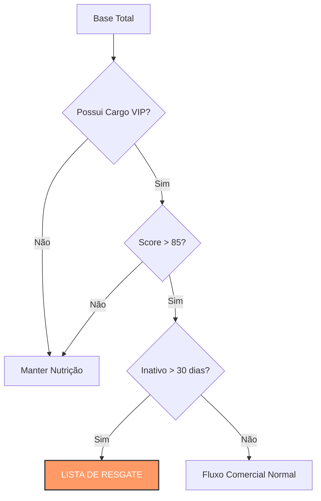

# ⚔️ Caso 5: O Resgate da Elite (Lógica de Precedência)

### 📌 Contexto
Este caso demonstra o uso estratégico de lógica booleana avançada para recuperar oportunidades de alto valor que esfriaram no funil comercial por falta de interação.

---

### 🧠 Sobre o caso
Identificamos que uma parcela crítica de leads com cargos de decisão (C-Level e Diretores) estava sem interações do time comercial há mais de 30 dias, o que representa um risco de perda de receita qualificada. Para solucionar esse problema, desenvolvi uma query de auditoria que utilizou parênteses para garantir a precedência correta dos filtros, isolando apenas os cargos de liderança com alto score de interesse histórico e inatividade prolongada. Essa ação de "resgate" permitiu a elaboração de uma lista prioritária de 450 leads estratégicos, resultando na abertura imediata de 15 novas oportunidades de negócio que estavam anteriormente estagnadas.

---

### 💻 Código SQL

```sql
/* Objetivo: Recuperação de Leads VIP Inativos */

SELECT 
    nome, 
    cargo, 
    score,
    dias_desde_ultimo_contato
FROM 
    leads_potenciais
WHERE 
    (cargo = 'coordenador' OR cargo = 'diretor' OR cargo = 'ceo') 
    AND score > 85 
    AND dias_desde_ultimo_contato > 30;
```

---

### 📊 Visualização de Lógica (Mockup)



---

### 💡 Explicação de Negócio
No CRM, o tempo é o maior inimigo da conversão; quanto mais tempo um lead qualificado leva sem contato, menores são as chances de fechamento. Esta query atua como um sistema de segurança operacional, garantindo que o investimento na aquisição de perfis de alto escalão não seja desperdiçado por falhas de processo. A precisão na lógica de parênteses é fundamental para evitar abordagens indevidas em perfis que não atendem aos critérios de urgência e importância definidos pela estratégia de vendas.

---
[⬅️ Voltar para o README Principal](../README.md)
```
