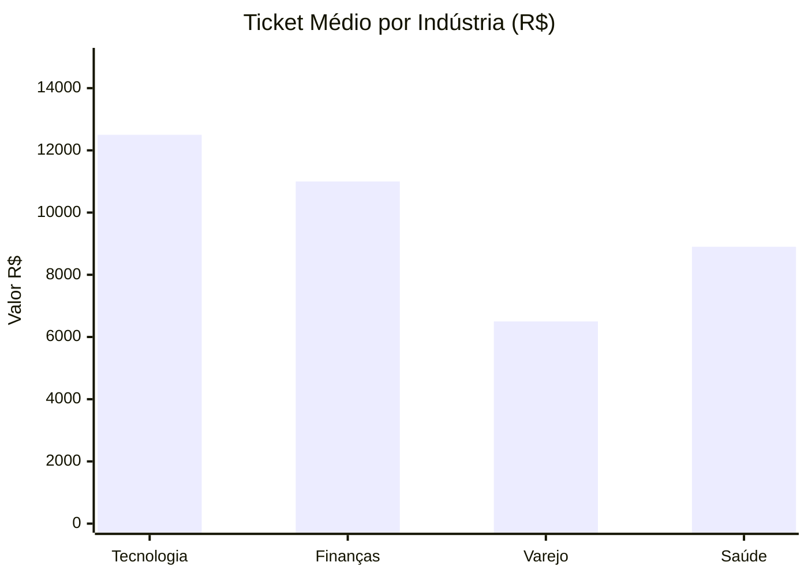

# 💰 Caso 5: Análise de Rentabilidade

### 📌 Contexto
Uso de inteligência financeira aplicada ao marketing e vendas para identificar os segmentos de mercado mais lucrativos.

---

### 🧠 Sobre o caso
A empresa planejava sua expansão de mercado para o próximo ano, mas enfrentava dificuldades para decidir qual indústria deveria receber o maior aporte de investimento em mídia paga. Para apresentar uma resposta baseada em dados, utilizei a função de agregação `AVG()`, agrupada por indústria, para calcular o valor médio do contrato (ticket-médio). O resultado apontou que o setor de Tecnologia apresentava um ticket médio 40% superior ao dos demais segmentos, tornando-se o foco estratégico para a expansão anual.

---

### 💻 Código SQL
Objetivo: Identificar rentabilidade por segmento via ticket-médio

```sql
SELECT 
    setor, 
    ROUND(AVG(valor_contrato), 2) AS ticket_medio,
    COUNT(id) AS volume_vendas
FROM 
    vendas 
GROUP BY 
    setor 
ORDER BY 
    ticket_medio DESC;
```

---

### 📊 Comparativo Financeiro (Mockup)



---

### 💡 Explicação de Negócio
Nem todo cliente tem o mesmo impacto na receita. Esta análise ajuda a definir com precisão a estratégia de Sales Mix, garantindo que o orçamento de aquisição e o esforço de vendas sejam canalizados prioritariamente para os nichos de mercado com maior margem de contribuição e retorno sobre o investimento.

[⬅️ Voltar para o README Principal](https://github.com/daniloespeleta/sql-crm-portfolio/blob/main/README.md)
